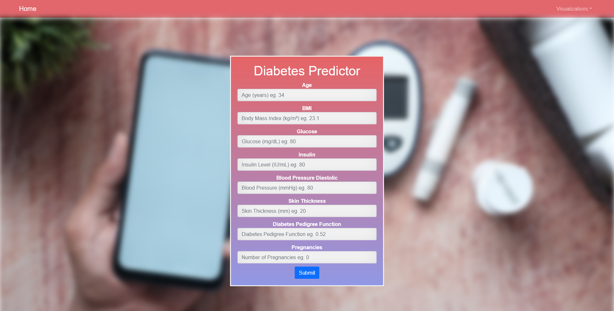
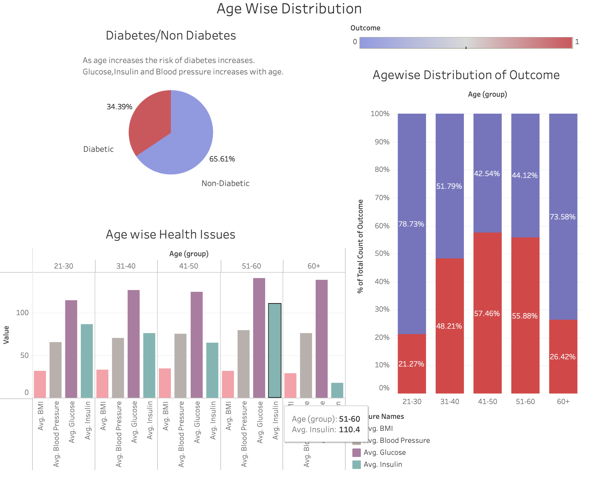
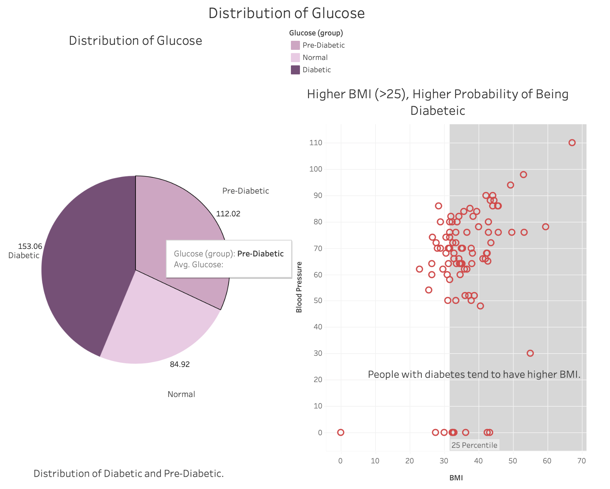
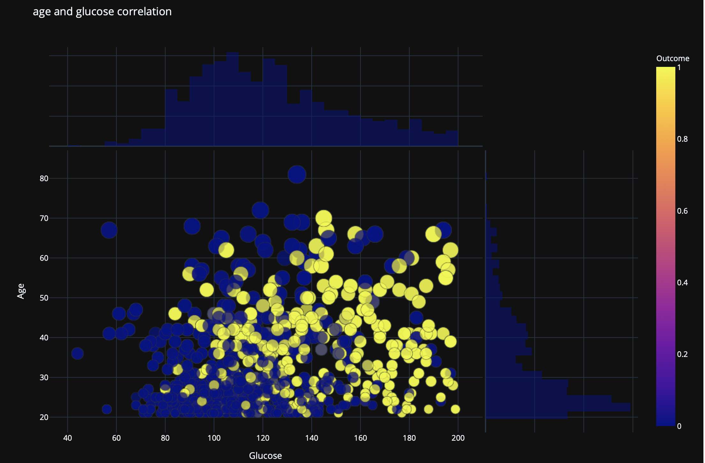
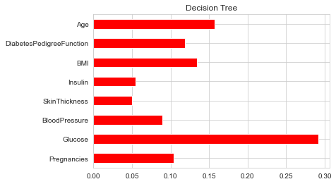
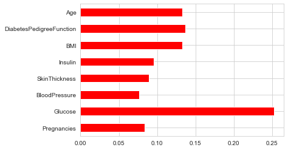
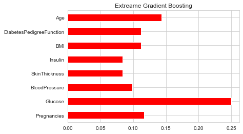

# Diabetes Prediction- Machine Learning

## Table of contents

- [Diabetes Prediction- Machine Learning](#diabetes-prediction--machine-learning)
  - [Table of contents](#table-of-contents)
  - [Project Summary](#project-summary)
  - [Technologies](#technologies)
  - [Data sources](#data-sources)
  - [Data Cleaninng](#data-cleaninng)
  - [Visualization](#visualization)
- [Models](#models)
  - [Decision Tree](#decision-tree)
  - [Random Forest](#random-forest)
  - [Extreme Gradient Boosting](#extreme-gradient-boosting)
  - [Meet our team](#meet-our-team)

## Project Summary

What is Diabetes?

[Diabetes](https://www.niddk.nih.gov/health-information/diabetes/overview/what-is-diabetes) is a disease that occurs when your blood glucose, also called blood sugar, is too high. Blood glucose is your main source of energy and comes from the food you eat. Insulin, a hormone made by the pancreas, helps glucose from food get into your cells to be used for energy. Sometimes your body doesn’t make enough—or any—insulin or doesn’t use insulin well. Glucose then stays in your blood and doesn’t reach your cells.

Over time, having too much glucose in your blood can cause health problems. Although diabetes has no cure, you can take steps to manage your diabetes and stay healthy.

Sometimes people call diabetes “a touch of sugar” or “borderline diabetes.” These terms suggest that someone doesn’t really have diabetes or has a less serious case, but every case of diabetes is serious.

## Technologies

- Machine Learning
- Jupyter Notebook / Pandas
- Javascript
- Flask App
- Plotly
- HTML / CSS
- Tableau

## Data sources

- <https://www.kaggle.com/vikasukani/diabetes-data-set>
- <https://www.kaggle.com/uciml/pima-indians-diabetes-database>

This dataset is originally from the [National Institute of Diabetes and Digestive and Kidney Diseases](https://repository.niddk.nih.gov/home/). The objective of the dataset is to diagnostically predict whether or not a patient has diabetes, based on certain diagnostic measurements included in the dataset. Several constraints were placed on the selection of these instances from a larger database.

## Data Cleaninng

The datasets consist of several medical predictor variables. Independent variables include the number of pregnancies the patient has had, their BMI, insulin level, age, skin thickness, and so on.

- Pregnacies: Number of times pregnant
- Glucose: Plasma glucose concentration a 2 hours in an oral glucose tolerance test
- Blood Pressure: Diastolic blood pressure (mm Hg)
- Skin Thickness: Triceps skin fold thickness (mm)
- Insulin: 2-Hour serum insulin (mu U/ml)
- BMI: Body mass index (weight in kg/(height in m)^2)
- Diabetes Pedigree: A function which scores likelihood of diabetes based on family history
- Age: Age in years
- Outcome: Class variable (0 or 1)

## Visualization

Aging is by far the strongest known risk factor of diabetes mellitus in the USA. In this graph, we can observe that the risk of diabetes disease can either be in young population or older but predominantly among those people age 45 years or older. They are more at risk for developing type 2 diabetes because as you get older, insulin secretion decreases, and changes in your body composition make it more insulin resistant. Both of these can lead to high blood sugar levels.

Glucose tolerance progressively declines with age, and there is a high prevalence of type 2 diabetes and postchallenge hyperglycemia in the older population. It is clear that in this graph there is a strong case of people with diabetes. Because of insulin helps control blood glucose levels everything is related (glucose, insulin, and age)
# Models

## Decision Tree

A Decision Tree regresses values in a tree form structure. Simply put, it starts with the first varible and finds out all possible outcomes for that varible. Using these outcomes it then moves on to the next varible and finds all possible outcomes with regards to the first varible. It creates mulitiple small constituents of the larger data set to create its predictions. Varibles are broken up into leaf nodes (a decision on a numerical value) and decision nodes (a decision on a categorical value)

## Random Forest

Random Forest is similar to Decision Tree in that they both use the concept of Decision Trees. The difference is that DT is built on an entire dataset while Random Forest will randomly select specific varibles and features and use these selections to build mulitiple decisions trees. This Visulization shows the importance of each varible included in the Random Forest regression. Glucose proves to be the most influential varible in regards to wether a person has diabetes or not. BMI, Age and DPF generally tie for second place.

## Extreme Gradient Boosting

Extream Gradient Boosting regresses values similar to a decision tree with a few differences. The main difference being it uses a more regularized model formalization to control over-fitting, which gives it better performance than ml techniques like Decision Tree.

## Meet our team

- [Bryant Mondragon](https://github.com/MondragB)
- [Walter Depalma](https://github.com/Wdepalma)
- [Rosali Gonzalez](https://github.com/applepassion4)
- [Sam Schappel](https://github.com/sammyschapps87)
- [Vasav Dave](https://github.com/vasavdave)
- [Shreyas Srivastav](https://github.com/ssrivastav0494)
